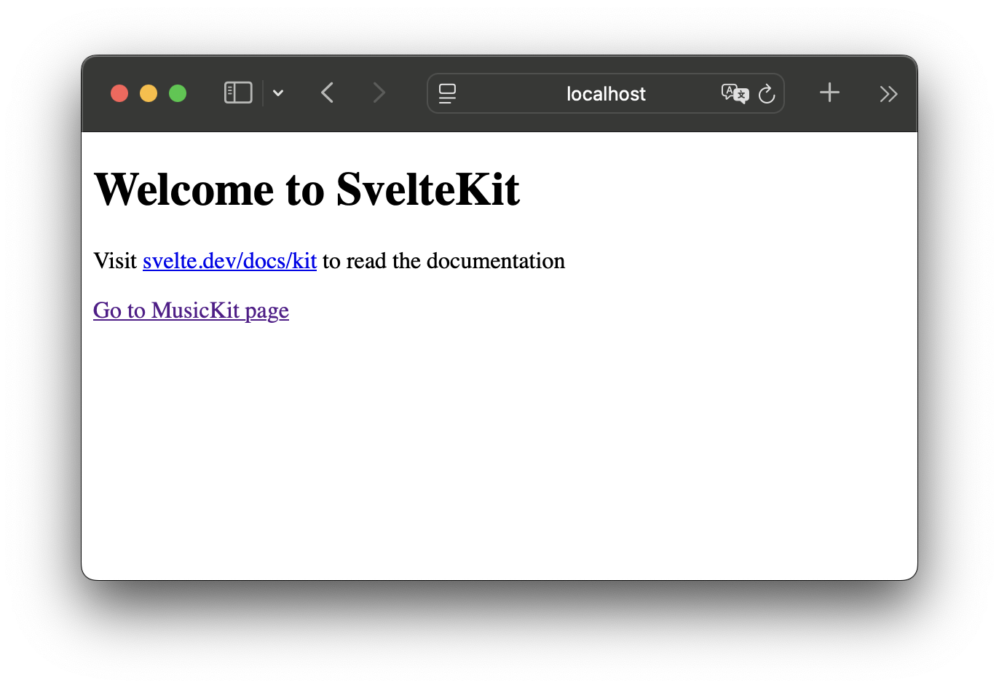
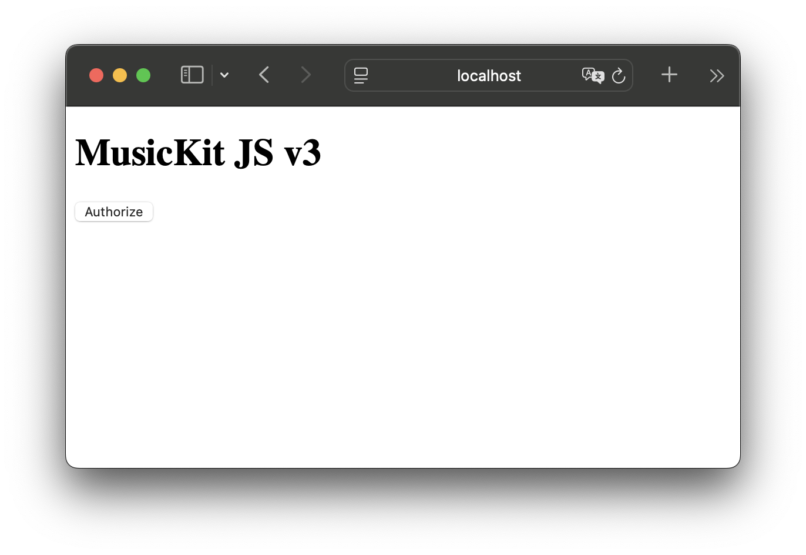

# musickitjs-v3-types

Demo app for showing typing issues with MusicKit JS v3 in TypeScript.

## Problem

MusicKit JS doesn't provide TypeScript type definitions, and we need to rely on third party efforts through the
DefinitelyTyped repository with its [@types/musickit-js][dt] package. That package targets v1 of MusicKit JS.

MusicKit JS v3 has been released with [breaking changes][v3], where `MusicKit.configure()` now returns a promise.
If not awaited, this can cause race conditions, as can be tested in this example app.

Refer to `src/routes/musickit/+page.svelte` line 45. Removing the `await` could cause the race condition when reloading
the page in the browser.

Ideally, official type definitions for MusicKit JS would be published, since it appears it is developed in TypeScript
already, as noted in this forum thread:
<https://developer.apple.com/forums/thread/786780>.

This repo serves as a demo for a WWDC MusicKit Lab session with Apple engineers.

[dt]: https://www.npmjs.com/package/@types/musickit-js
[v3]: https://js-cdn.music.apple.com/musickit/v3/docs/index.html?path=/story/tech-notes-migrating-to-v3--page

## Prerequisites

- Node.js (tested with v22 LTS)
- MusicKit Developer Token, see: <https://developer.apple.com/documentation/applemusicapi/generating-developer-tokens>

## Initial setup

```sh
npm install
```

Store your developer token in a `.env` file inside the `app` folder.

```ini
MUSICKIT_DEVELOPER_TOKEN="YOUR_JWT_TOKEN_GOES_HERE"
```

## Running locally

To run the SvelteKit server locally with Vite, run the command:

```sh
npm run dev
```


Open the Local web address in your browser.

You should now see the Welcome page. Click the 'Go to MusicKit page' link.




On that page you can authorize with MusicKit.
